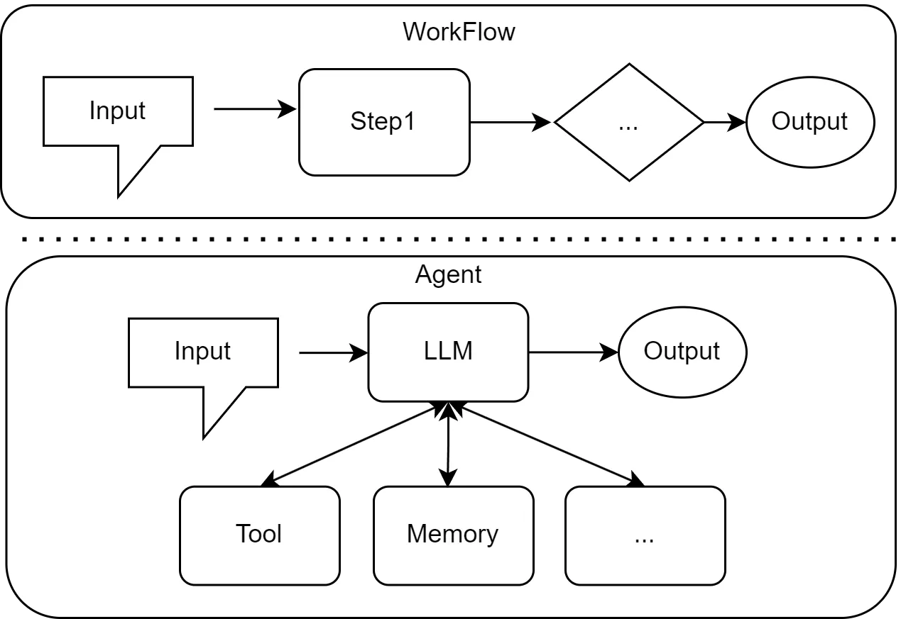
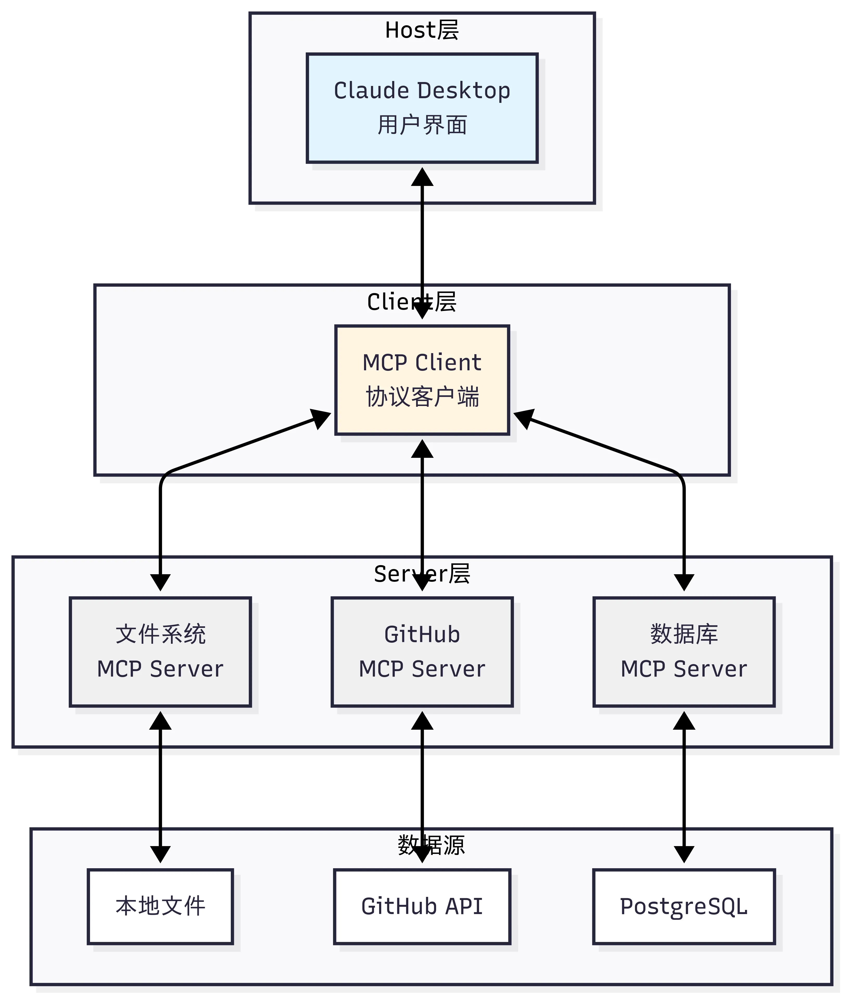
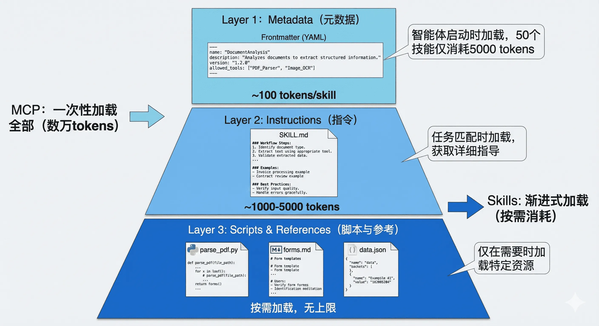
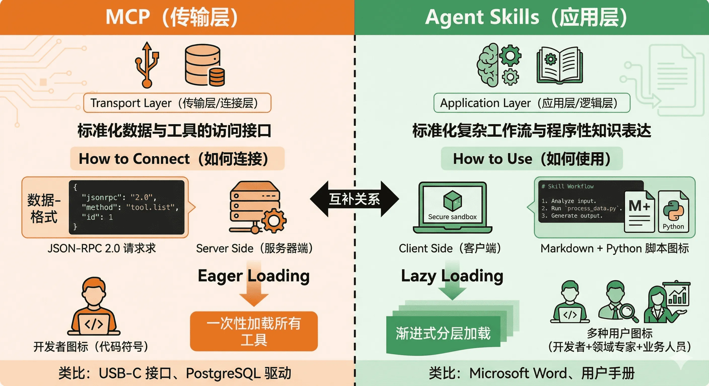
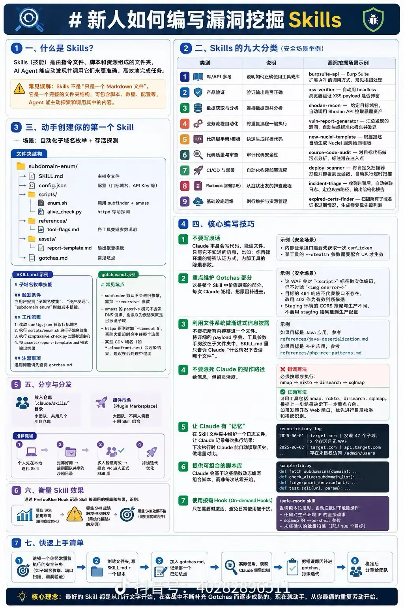

## 前言

从第二届tch开始到现在，agent浪潮越来越猛烈。AI是2022年GPT率先引起的技术海啸，改变了人机交互的方式，LLM不断发展，使AGI发展的越来越快。2024年llm百花齐放，2025年agent开始争斗。2026年龙虾的出现，使claw系列agent高强度曝光，技术的焦点正从训练更大、更强的基础模型，转向如何构建更聪明、更高效的智能体应用。

单个智能体已经能胜任特定领域的任务，而由多个智能体分工、协作、甚至辩论，共同完成一个宏大目标的多智能体系统（Multi-Agent System, MAS），则被视为释放 LLM 全部潜能、解决真实世界复杂问题的关键钥匙。

## Agent定义

首先要知道，LLM和Agent是有本质区别的

### 1. 核心定义与角色演变

**LLM (Large Language Model - 大语言模型)**
本质：一个基于海量数据训练的统计概率模型。
特点：擅长文本生成、代码编写、逻辑推理和语意理解。
局限：
被动性：输入一个 Prompt，输出一个 Response，不问不动。
时效性：知识停留在训练集截止日期（存在幻觉）。
无工具能力：默认无法直接联网、无法执行本地脚本、无法操作数据库。

**Agent (AI智能体)**
本质：一个以 LLM 为核心引擎的自主行动系统。
特点：能够根据用户提出的复杂目标，自主进行任务拆解、规划路线、调用外部工具、评估结果，并最终完成任务。
进化：它让 LLM 从一个“只能聊天的军师”，变成了“能提笔写代码、能上机调漏洞的实干家”。

### 2. Agent 的四大核心支柱 (架构)

一个成熟的 AI Agent 系统（如 AutoGPT、LangChain Agent，或安全领域的自动化黑客工具），通常由以下四个部分组成：

1. Core LLM
2. Planning
3. Memory
4. Tools

agent更像是在基于LLM赋予他更强的能力，不局限与web端的交互，而是拓展到app、shell等等

### 3. 作为开发者工具的智能体

在这种模式下，智能体被深度集成到开发者的工作流中，作为一种强大的辅助工具。它增强而非取代开发者的角色，通过自动化处理繁琐、重复的任务，让开发者能更专注于创造性的核心工作。这种人机协同的方式，极大地提升了软件开发的效率与质量。

目前，市场上涌现了多款优秀的 AI 编程辅助工具，它们虽然均能提升开发效率，但在实现路径和功能侧重上各有千秋：

+ GitHubCopilot: 作为该领域最具影响力的产品之一，Copilot 由 GitHub 与 OpenAI 联合开发。它深度集成于 Visual Studio Code 等主流编辑器中，以其强大的代码自动补全能力而闻名。开发者在编写代码时，Copilot 能实时提供整行甚至整个函数块的建议。近年来，它也通过 Copilot Chat 扩展了对话式编程的能力，允许开发者在编辑器内通过聊天解决编程问题。
+ Claude Code: Claude Code 是由 Anthropic 开发的 AI 编程助手，旨在通过自然语言指令帮助开发者在终端中高效地完成编码任务。它能够理解完整的代码库结构，执行代码编辑、测试和调试等操作，支持从描述功能到代码实现的全流程开发。Claude Code 还提供了无交互（headless）模式，适用于 CI、pre-commit hooks、构建脚本和其他自动化场景，为开发者提供了强大的命令行编程体验。
+ Trae: 作为新兴的 AI 编程工具，Trae 专注于为开发者提供智能化的代码生成和优化服务。它通过深度学习技术分析代码模式，能够为开发者提供精准的代码建议和自动化重构方案。Trae 的特色在于其轻量级的设计和快速响应能力，特别适合需要频繁迭代和快速原型开发的场景。
+ Cursor: 与上述主要作为插件或集成功能存在的工具不同，Cursor 则选择了一条更具整合性的路径，它本身就是一个 AI 原生的代码编辑器。它并非在现有编辑器上增加 AI 功能，而是在设计之初就将 AI 交互作为核心。除了具备顶级的代码生成和聊天能力外，它更强调让 AI 理解整个代码库的上下文，从而实现更深层次的问答、重构和调试。

当然还有许多优秀的工具没有例举，不过它们共同指向了一个明确的趋势：AI 正在深度融入软件开发的全生命周期，通过构建高效的人机协同工作流，深刻地重塑着软件工程的效率边界与开发范式。


### 4. 作为自主协作者的智能体
与作为工具辅助人类不同，第二种交互模式将智能体的自动化程度提升到了一个全新的层次，自主协作者。在这种模式下，我们不再是手把手地指导 AI 完成每一步，而是将一个高层级的目标委托给它。智能体会像一个真正的项目成员一样，独立地进行规划、推理、执行和反思，直到最终交付成果。这种从助手到协作者的转变，使得 LLM 智能体更深的进入了大众的视野。它标志着我们与 AI 的关系从“命令-执行”演变为“目标-委托”。智能体不再是被动的工具，而是主动的目标追求者。

当前，实现这种自主协作的思路百花齐放，涌现了大量优秀的框架和产品，从早期的 BabyAGI、AutoGPT，到如今更为成熟的 CrewAI、AutoGen、MetaGPT、LangGraph 等优秀框架，共同推动着这一领域的高速发展。虽然具体实现千差万别，但它们的架构范式大致可以归纳为几个主流方向：

单智能体自主循环：这是早期的典型范式，如 AgentGPT 所代表的模式。其核心是一个通用智能体通过“思考-规划-执行-反思”的闭环，不断进行自我提示和迭代，以完成一个开放式的高层级目标。
多智能体协作：这是当前最主流的探索方向，旨在通过模拟人类团队的协作模式来解决复杂问题。它又可细分为不同模式： 角色扮演式对话：如 CAMEL 框架，通过为两个智能体（例如，“程序员”和“产品经理”）设定明确的角色和沟通协议，让它们在一个结构化的对话中协同完成任务。 组织化工作流：如 MetaGPT 和 CrewAI，它们模拟一个分工明确的“虚拟团队”（如软件公司或咨询小组）。每个智能体都有预设的职责和工作流程（SOP），通过层级化或顺序化的方式协作，产出高质量的复杂成果（如完整的代码库或研究报告）。AutoGen 和 AgentScope 则提供了更灵活的对话模式，允许开发者自定义智能体间的复杂交互网络。
高级控制流架构：诸如 LangGraph 等框架，则更侧重于为智能体提供更强大的底层工程基础。它将智能体的执行过程建模为状态图（State Graph），从而能更灵活、更可靠地实现循环、分支、回溯以及人工介入等复杂流程。
这些不同的架构范式，共同推动着自主智能体从理论构想走向更广泛的实际应用，使其有能力应对日益复杂的真实世界任务。在我们的后续章节中，也会感受不同类型框架之间的差异和优势。

### 3. Workflow 和 Agent 的差异

在理解了智能体作为“工具”和“协作者”两种模式后，我们有必要对 Workflow 和 Agent 的差异展开讨论，尽管它们都旨在实现任务自动化，但其底层逻辑、核心特征和适用场景却截然不同。

简单来说，Workflow 是让 AI 按部就班地执行指令，而 Agent 则是赋予 AI 自由度去自主达成目标。

这里采用网络上的图片




工作流是一种传统的自动化范式，其核心是对一系列任务或步骤进行预先定义的、结构化的编排。它本质上是一个精确的、静态的流程图，规定了在何种条件下、以何种顺序执行哪些操作。一个典型的案例：某企业的费用报销审批流程。员工提交报销单（触发）-> 如果金额小于 500 元，直接由部门经理审批 -> 如果金额大于 500 元，先由部门经理审批，再流转至财务总监审批 -> 审批通过后，通知财务部打款。整个过程的每一步、每一个判断条件都被精确地预先设定。

与工作流不同，基于大型语言模型的智能体是一个具备自主性的、以目标为导向的系统。它不仅仅是执行预设指令，而是能够在一定程度上理解环境、进行推理、制定计划，并动态地采取行动以达成最终目标。LLM 在其中扮演着“大脑”的角色。

`基于实时信息进行动态推理和决策的能力，正是 Agent 的核心价值所在。`

## 三种协议

如何让智能体与外部世界高效交互？如何让多个智能体相互协作？这正是智能体通信协议要解决的核心问题。

### mcp

大家应该很熟悉这个，比如日常使用的ida-mcp，jadx-mcp等等，为什么会有这些需求呢，本质是想让llm去调用这些tools，传统方式下，你需要为每个服务编写适配器代码，处理不同的 API、认证方式、错误处理等。这不仅工作量大，而且难以维护。更重要的是，不同 LLM 平台的 function call 实现差异巨大，切换模型时需要重写大量代码

MCP 的出现改变了这一切。它就像 USB-C 统一了各种设备的连接方式一样，MCP 统一了智能体与外部工具的交互方式。无论你使用 Claude、GPT 还是其他模型，只要它们支持 MCP 协议，就能无缝访问相同的工具和资源。

MCP 协议采用 Host、Client、Servers 三层架构设计



三层架构的职责：

+ Host（宿主层）：Claude Desktop 作为 Host，负责接收用户提问并与 Claude 模型交互。Host 是用户直接交互的界面，它管理整个对话流程。

+ Client（客户端层）：当 Claude 模型决定需要访问文件系统时，Host 中内置的 MCP Client 被激活。Client 负责与适当的 MCP Server 建立连接，发送请求并接收响应。

+ Server（服务器层）：文件系统 MCP Server 被调用，执行实际的文件扫描操作，访问桌面目录，并返回找到的文档列表。

完整的交互流程：用户问题 → Claude Desktop(Host) → Claude 模型分析 → 需要文件信息 → MCP Client 连接 → 文件系统 MCP Server → 执行操作 → 返回结果 → Claude 生成回答 → 显示在 Claude Desktop 上

这种架构设计的优势在于关注点分离：Host 专注于用户体验，Client 专注于协议通信，Server 专注于具体功能实现。开发者只需专注于开发对应的 MCP Server，无需关心 Host 和 Client 的实现细节。

MCP 协议提供了三大核心能力，构成完整的工具访问框架:`tools` `Resources` `Prompts`

其实更关键的问题是，llm是怎么知道该用这个工具的

当用户提出问题时，完整的工具选择流程如下：

1. 工具发现阶段：MCP Client 连接到 Server 后，首先调用list_tools()获取所有可用工具的描述信息（包括工具名称、功能说明、参数定义）

2. 上下文构建：Client 将工具列表转换为 LLM 能理解的格式，添加到系统提示词中。例如：

3. 你可以使用以下工具：
```
- read_file(path: str): 读取指定路径的文件内容
- search_code(query: str, language: str): 在代码库中搜索
Copy to clipboardErrorCopied
```

4. 模型推理：LLM 分析用户问题和可用工具，决定是否需要调用工具以及调用哪个工具。这个决策基于工具的描述和当前对话上下文

5. 工具执行：如果 LLM 决定使用工具，Client 通过 MCP Server 执行所选工具，获取结果

6. 结果整合：工具执行结果被送回给 LLM，LLM 结合结果生成最终回答

这个过程是完全自动化的，LLM 会根据工具描述的质量来决定是否使用以及如何使用工具。因此，编写清晰、准确的工具描述至关重要。

这个时候就要说到mcp的传输方式了

1. http
2. studio
3. sse
4. memory
5. StreamableHTTP

这里就不得不吐槽一点了，codex貌似对一些方式支持不太好（

其实随着mcp的发展，越来越多的用户都在抛弃mcp了，原因其实在于，大部分mcp是给gui工具准备的，而在自动化流程面前，打开gui肯定是一个麻烦的事情，或者说该被淘汰的事情，所以越来越多的工具mcp奔赴cli工具流。比如ida-mcp有了idalib-mcp

#### Skills 与 MCP

mcp会有两个根本性问题

第一个问题是上下文爆炸。为了让智能体能够灵活查询数据库，MCP 服务器通常会暴露数十甚至上百个工具（不同的表、不同的查询方法）。这些工具的完整 JSON Schema 在连接建立时就会被加载到系统提示词中，可能占用数万个 token。据社区开发者反馈，仅加载一个 Playwright MCP 服务器就会占用 200k 上下文窗口的 8%，这在多轮对话中会迅速累积，导致成本飙升和推理能力下降。

第二个问题是能力鸿沟。MCP 解决了"能够连接"的问题，但没有解决"知道如何使用"的问题。拥有数据库连接能力，不等于智能体知道如何编写高效且安全的 SQL；能够访问文件系统，不意味着它理解特定项目的代码结构和开发规范。这就像给一个新手程序员开通了所有系统的访问权限，但没有提供操作手册和最佳实践。

这正是 Agent Skills 要解决的核心问题。2025年初，Anthropic 在推出 MCP 之后，进一步提出了 Agent Skills 的概念，引发了业界的广泛关注。有开发者评论说："Skills 和 MCP 是两种东西，Skills 是领域知识，告诉模型该如何做，本质上是高级 Prompt；而 MCP 对接外部工具和数据。" 也有人认为："从 Function Call 到 Tool Call 到 MCP 到 Skills，核心大差不差，就是工程实践和表现形式的优化演进。"

Agent Skills 最核心的创新是渐进式披露（Progressive Disclosure）机制。这种机制将技能信息分为三个层次，智能体按需逐步加载，既确保必要时不遗漏细节，又避免一次性将过多内容塞入上下文窗口。




第一层：元数据（Metadata）

在 Skills 的设计中，每个技能都存放在一个独立的文件夹中，核心是一个名为 SKILL.md 的 Markdown 文件。这个文件必须以 YAML 格式的 Frontmatter 开头，定义技能的基本信息。

当智能体启动时，它会扫描所有已安装的技能文件夹，仅读取每个 SKILL.md 的 Frontmatter 部分，将这些元数据加载到系统提示词中。根据实测数据，每个技能的元数据仅消耗约 100 个 token。即使你安装了 50 个技能，初始的上下文消耗也只有约 5,000 个 token。

这与 MCP 的工作方式形成了鲜明对比。在典型的 MCP 实现中，当客户端连接到一个服务器时，通常会通过 tools/list 请求获取所有可用工具的完整 JSON Schema，可能立即消耗数万个 token。

第二层：技能主体（Instructions）

当智能体通过分析用户请求，判断某个技能与当前任务高度相关时，它会进入第二层加载。此时，智能体会读取该技能的完整 SKILL.md 文件内容，将详细的指令、注意事项、示例等加载到上下文中。

此时，智能体获得了完成任务所需的全部上下文：数据库结构、查询模式、注意事项等。这部分内容的 token 消耗取决于指令的复杂度，通常在 1,000 到 5,000 个 token 之间。

第三层：附加资源（Scripts & References）

对于更复杂的技能，SKILL.md 可以引用同一文件夹下的其他文件：脚本、配置文件、参考文档等。智能体仅在需要时才加载这些资源。

举例经典的skill结构

```
skills/pdf-processing/
├── SKILL.md              # 主技能文件
├── parse_pdf.py          # PDF 解析脚本
├── forms.md              # 表单填写指南（仅在填表任务时加载）
└── templates/            # PDF 模板文件
    ├── invoice.pdf
    └── report.pdf
```

在 SKILL.md 中，可以这样引用附加资源：
  + 当需要执行 PDF 解析时，智能体会运行 parse_pdf.py 脚本
  + 当遇到表单填写任务时，才会加载 forms.md 了解详细步骤
  + 模板文件只在需要生成特定格式文档时访问

这种设计有两个关键优势：

无限的知识容量：通过脚本和外部文件，技能可以"携带"远超上下文限制的知识。例如，一个数据分析技能可以附带一个 1GB 的数据文件和一个查询脚本，智能体通过执行脚本来访问数据，而无需将整个数据集加载到上下文中。

确定性执行：复杂的计算、数据转换、格式解析等任务交给代码执行，避免了 LLM 生成过程中的不确定性和幻觉问题。

渐进式披露的效果：从 16k 到 500 Token

社区开发者分享的实践案例充分证明了渐进式披露的威力。在一个真实场景中：

+ 传统 MCP 方式：直接连接一个包含大量工具定义的 MCP 服务器，初始加载消耗 16,000 个 token
+ Skills 包装后：创建一个简单的 Skill 作为"网关"，仅在 Frontmatter 中描述功能，初始消耗仅 500 个 token

当智能体确定需要使用该技能时，才会加载详细指令并按需调用底层的 MCP 工具。这种架构不仅大幅降低了初始成本，还使得对话过程中的上下文管理更加精准和高效。



### A2A

先鸽子一下

### ANP

先鸽子一下

## agent开发架构

其实现在agent开发架构越来越多。

众人熟知的有`LangGraph+LangChain`，`CrewAI`，`Anthropic Claude Agent SDK`，`OpenAI Agents SDK / Google ADK`，`eino`，`pi`等等

框架不一样的区别主要在于性能和开发时间以及维护成本上。部分架构对自家模型适配度较高，但是对外者就不太友好了（

上面说的是agent开发的底层模块，架构层面其实也是百花齐放

比如

+ 第二届tch上有亮眼表演的`黑板架构`
+ 主从架构
+ 层级联邦
+ 动态群聊
+ 等等

这里着重说一下常见的

### 黑板架构

这里以LangGraph的经典开发方式为例子

+ 如何实现黑板：LangGraph 拥有一个极其强大的 全局状态机（Global State）。在配置图时，你可以不定义固定的 A 节点到 B 节点的单向边，而是把所有专家 Agent（节点）都连向一个中央决策节点（Controller）。

+ 工作模式：
    + 漏洞分析 Agent 发现了一个反序列化点，将这个信息写入全局 State（黑板）。
    + 中央路由（通过 LLM）检查 State，发现有了反序列化点，但缺 Gadget 链。
    + 动态触发 Gadget挖掘Agent 上场，它读走信息，挖到链条后，再写回 State。

其实黑板架构是一个很适合安全领域的架构，优势在于不同角色之间共享知识点和新发现，可以异步、并发、基于状态触发，传统的线性 Pipeline 根本无法胜任这种高强度的黑客对抗

OpenDevin / SWE-agent等知名agent也是采用这种架构为底座进行开发的

### 动态群聊架构

更像是一个黑客俱乐部的自由讨论群

+ 结构：群里有各种专家（Sub-Agents），同时还有一个“群聊管理员”（Group Chat Manager）。
+ 流程：没有死板的“你一句我一句”的顺序。任务丢进群里后，由大模型动态决定下一句话谁来说、谁来接单。
+ 示例（CTF/安全场景）：
   1. 用户：抛出一个固件（Firmware）。
   2. 解包专家 自发冒泡：“我看到这是一个 SquashFS 固件，我已经把它解开了，里面有一个 vulnerabilities.cgi。”（发布到群聊）
   3. 此时，逆向专家 和 Web专家 都在群里。Manager（也是个LLM）动态判断：当前解出了 Web 源码，应该让 Web专家 说话。
   4. Web专家：“我看了一下这个 CGI，有一个明显的缓冲区溢出漏洞，通过 POST 的 password 参数触发。”
   5. Manager 此时判断：涉及溢出和二进制，应该切给 Pwn专家。
   6. Pwn专家 冒泡：“收到，我来写 pwntools 脚本……”

动态群聊的精髓在于 Next Speaker Selection（下一言者预测）。在框架底层（如 AutoGen / AG2 的 GroupChat），每当有人说完全局上下文后，系统会触发一个机制：
1. 收集所有人选：列出当前群里所有 Sub-Agent 的系统提示词（System Prompt/Identity）。
2. LLM 选人：把当前的“聊天历史”和“人选列表”喂给一个强推理大模型（通常是 Manager），问它：“根据现在的进度，你觉得下一个谁发言最合适？”
3. 自主决定：大模型可能会选择 Web专家，也可能会选择让 User（人类）介入提供输入，甚至如果任务完成了，它会选择 Reporter 来做总结。

这样会有很明显的缺点，token消耗快，容易上下文爆炸，可控性不够。

所以我们现在的开发，越来越奔向混合架构

## 如何写出好的 Skill

其实我感觉有一个skill很不赖，[ui-ux-pro-max-skill](https://github.com/nextlevelbuilder/ui-ux-pro-max-skill)，b站上有一个视频解读过这个skill，[skills多了应该怎么做?](https://www.bilibili.com/video/BV1yTQrBnEoj/?share_source=copy_web&vd_source=4b59b7952acd90b154bddabab8cfb111)
这个是我目前开发skill的宗旨吧算是（

同时一些师傅也在网上发过相关的skill编写技巧，比如




核心宗旨是：坚持渐进性纰漏，对ai有一定的约束，并且要有一定的自由

```
根本约束：简洁 
 ├── 信息放在哪里？ → 三级分层，按需加载
 ├── 给 AI 多大自由度？ → 脆弱操作脚本锁死，创造性工作文字引导
 └── 怎么落地？ → 六步流程：理解→规划→初始化→编辑→校验→迭代
```

Skill是给 AI 写指令，而不是给人。用最少的 token，在正确的层级，给 AI 最精准的约束，让它在边界内自由发挥。

## 为什么要自己开发agent

总有人会说`claude code` `codex`等等已经很强了，为什么还要自己开发呢？

我认为常见的agent都有自己的侧重点，比如`coding` `talk` `全局托管`等等，但是我们日常工作中，往往有的是一个准确的明确的目标，比如ctf要拿到flag，渗透想getshell

当我们有了目的性，那么就不是全能agent可以完成的了，我们就会自己去优化，自己去编写agent。

就像第二届tch中，纯用`claude code`和`codex`的名次并不理想，总体并没有自研agent好。

所以，我们需要的不是agent，而且一个针对性的工具。
