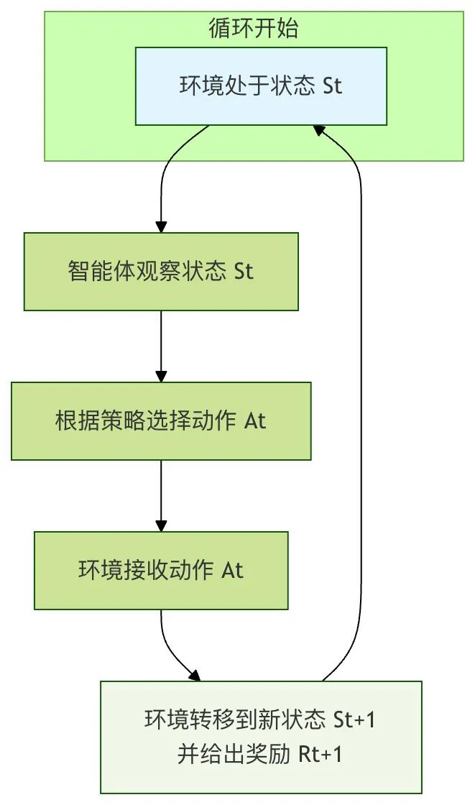

## 前言

这两天工作很忙啊我靠，但是毕设还是得写，大概率就是一个红队agent当毕设了(也许吧)，近期看了很多博客和开源项目

项目这里主要是绿盟小分队的、muteki
## 参考感悟


### 绿盟

他们的特点主要是在于上下文压缩机制很强。

详细位置主要是在`./BreachWeave/packages/core/src/solver/extension`里面

```
import type { ExtensionFactory } from "@mariozechner/pi-coding-agent"

const WORKSPACE_DIRS = {
    auth: "auth",
    evidence: "evidence",
    subAgents: "sub-agents",
} as const

const WORKSPACE_FILES = {
    scope: "scope.md",
    findingsNdjson: "findings.ndjson",
} as const

export function pentestCompactionExtension(): ExtensionFactory {
    return (pi) => {
        pi.on("session_compact", async (event) => {
            const timestamp = new Date().toISOString()
            console.error(
                `[${timestamp}] COMPACTION: fromExtension=${event.fromExtension}, summary length=${event.compactionEntry.summary.length}`,
            )
        })
    }
}

export function getPentestCompactionInstructions(): string {
    return `When summarizing this conversation for compaction, you MUST preserve:

1. Scope: All in-scope and out-of-scope targets from ${WORKSPACE_FILES.scope}
2. Known Assets: All discovered assets, endpoints, parameters, technologies
3. Active Hypotheses: All current vulnerability hypotheses and their status
4. Confirmed Findings: All verified or candidate findings with evidence references from ${WORKSPACE_FILES.findingsNdjson}
5. Auth State: Any authentication tokens, cookies, or session information in ${WORKSPACE_DIRS.auth}/
6. Evidence Paths: All file paths in ${WORKSPACE_DIRS.evidence}/ and ${WORKSPACE_DIRS.subAgents}/
7. Current Phase: What methodology phase we are in (SCOPE/RECON/HYPOTHESIZE/TEST/DOCUMENT/REPORT)
8. Next Actions: What should be done next

You may discard:
- Verbose HTTP response bodies
- Failed/dead-end exploration details
- Redundant tool output
- Intermediate reasoning that led to already-documented conclusions

Format the summary as structured sections, not prose.`
}
```

并且后面带了个`rtk`进行压缩指令的输出

这里就不得不提到pi在压缩上下文的窘境了。pi的`/compact`并没有针对各家的模型做原生的压缩处理，比如codex什么的，所以市面上也有一些插件可以处理

#### 小设想

前两天和一个搞ai的朋友聊天就说到了这个问题，agent使用期间难免上下文爆炸，`compact`后会有信息损失，这种情况该怎么处理。

他给我说了很多算法什么的，叽里咕噜的听不懂

```
我：我现在是让一个单独的agent进行压缩回传
他：那你是怎么规范这个agent的呢
我：代码层面直接写，比如多少轮或者是遇到了多少次的错误什么的
他：那你是不是没有让他学会这个事情
我：我就是写skill+hook机制让他调用就行了
他：那你有没有想过强化训练，然后让ai真的学会这个事情？
.......
```

这个思路给了我很大的震撼，当时想了很多的问题，比如是不是真的可行？

> 强化学习本质如图




哎，那我一想确实哎，这样是很好的思路，但是需要大量的数据去支撑，但是这种针对于某一点的技能，该怎么样去创造数据呢？这是个问题。。。


### muteki

这是我感觉新兴的黑板架构里面很屌的一个了，强的不是黑板架构，而是他的状态机管理，

```
┌─────────────────────────────────────────────────────────┐
│前端层(呈现)Web指挥台(Next.js)/TUI(Textual)              │
│哑订阅者：只订阅事件流(SSE)+POST命令，从不直调核心       │
├─────────────────────────────────────────────────────────┤
│控制平面层FastAPI server.py+RunManager                   │
│事件总线EventBus(唯一对外契约：有序·带类型·单调序号)     │
├─────────────────────────────────────────────────────────┤
│调度大脑层(Coordinator Swarm)                            │
│协调器OODA循环(2s/拍)+Reason规划器(deepseek)             │
│SharedGraph共享黑板(SQLite,事件溯源)+InsightBus          │
│Gate闸门(唯一硬编码的flag接受函数)                       │
├─────────────────────────────────────────────────────────┤
│执行层(Workers)异构CLI Agent+blackboard skill            │
│local:宿主子进程container:Kali容器+Go反向连接            │
└─────────────────────────────────────────────────────────┘
```

我感觉他的调度和思维模式要比`Cairn`要强，不过那个项目算是安全行业里面黑板架构的鼻祖了吧

#### 1. Coordinator / Swarm（muteki/swarm/swarm.py，4843 行）

宿主上的调度大脑，跑 2 秒一拍的 OODA 循环。自己从不解题，只负责「读图、决定派什么、派几个、何时停」。
- 派发策略：开局 2 个 bootstrap，普通 worker 上限 ~10；空槽每拍只补 1 个（避免一窝蜂同生共死把靶机限流打挂）；优先选当前没在跑的引擎（异构互补）。
- 停止条件：第一个合规 flag 即胜，其余 worker 立刻取消。CTF 保证有解 → swarm 默认永不自己放弃；连续 N 个 worker 无产出才软暂停等人。
- 健康降级：派发前探活每个引擎，挂了临时踢出名册，恢复再归队（带 TTL 缓存避免每次都 shell CLI 探活）。

#### 2. Reason 规划器（muteki/solver/reason.py）

用一个便宜的推理模型（默认 deepseek-v4-pro/flash），把整块黑板喂进去，做两件事：
- 乐观规划：读图 → 提出非重叠的 intent（typed task：code / shell_agent / verifier / review）。
- 证据审计（防幻觉）：扫描 candidate（未验证）证据，拒绝在未验证 fact 上构建关键 intent，把「仅在反驳时才验证」前移到「规划时就质疑」。
- 返回三态 verdict：complete / course_correct / explore。只在黑板变化时触发。

#### 3. SharedGraph 共享黑板（muteki/swarm/shared_graph.py，4171 行）

每题一个 SQLite 文件、事件溯源的证据图，是唯一事实来源。
- 后端选型：本地直连 SQLite（WAL 天然支持多进程并发读写），不开 HTTP server（同宿主子进程共享一个 .db）。SharedGraph Protocol 保留换后端可能。
- 事件溯源（C）：events 表只 INSERT 不 UPDATE/DELETE，facts/intents 是折叠出来的物化视图，可丢弃重建。溯源免费（每条 fact 的来源就是它的事件）、支持时间旅行回放。
- 认领原子性（B）：intent 认领是单条 UPDATE + changes() 守护，零 TOCTOU 窗口。
- 存五样东西：Facts / Intents / Dead-ends / Flags / PoCs。
- 去重三件套：route（同方向折叠）/ lane（危险独占资源串行化）/ branch（竞争假设分头证伪），防 N 个 worker 撞车。

#### 4. muteki-blackboard skill（skills/muteki-blackboard/，SKILL.md + blackboard.py 648 行）

worker 读/写黑板的唯一通道——这是「群体协作」真正落地的地方。
- 接入：协调器给每个 worker 注入三个环境变量 MUTEKI_BLACKBOARD_DB / MUTEKI_WORKER_ID / MUTEKI_INTENT_ID，CLI Agent 自动发现这个 skill。
- 命令接口：read-deadends / read-facts / read-flags / list-intents / claim I3（打 WON/LOST）/ claim-resource（独占锁）/ write-fact --verified / mark-deadend / read-directives。
- 为什么是 skill 而非直接写库：① worker 跨进程/跨容器，CLI 脚本是唯一能用接口；② write-fact --verified 仍要宿主侧过闸门，agent 说 verified 不等于真 verified；③ SKILL.md 把「何时读、何时写」的纪律教给 agent，让它主动协作。
- 兜底：worker 没调 skill 时，输出里的 VERIFIED_FACT= / FOUND_FLAG= 标记也会被宿主收割——安全网，主通道始终是 skill。

#### 5. Gate 闸门（muteki/solver/gate.py，硬编码不可插拔）

唯一硬编码、不可插拔的 flag 接受函数（§8 明确不可达）。一个 flag 被接受必须：
- ① 格式对（匹配 challenge flag_format）
- ② 不是占位符（拒 flag{...}、{uuid}、<flag>、纯标点、逗号集合等模板）
- ③ 逐字出现在真实命令输出里（或在被引用的 artifact 内容里）
模型无法通过 Result dict 或任何旁路把幻觉 flag 蒙混过关——这是整个项目的防幻觉护城河。

#### 6. InsightBus（muteki/swarm/insight_bus.py）

黑板是持久存储（落盘+审计），InsightBus 是它旁边的内存广播：谁刚确认一条事实，立刻推给正在跑的队友，不用等他们查数据库。只共享已验证的客观事实——从不共享猜测，避免把全队带偏向某个 agent 的错误假设。

#### 7. Worker（muteki/solver/cli_solver.py 3701 行 + cli_driver.py 1919 行）

「带壳的 CLI Agent」，单发（single-shot）：领一个任务跑到自然退出点就结束，不中途 resume。指令只注入到下一个新 worker，不打扰正在跑的。
四角色：

```
┌───────────┬─────────────────────────────────────────────────────────┐
│ 角色      │ 职责                                                    │
├───────────┼─────────────────────────────────────────────────────────┤
│ race      │ 开局多引擎并行扑整题做侦察                              │
├───────────┼─────────────────────────────────────────────────────────┤
│ bootstrap │ 整题深度冲刺                                            │
├───────────┼─────────────────────────────────────────────────────────┤
│ explore   │ 只认领一个 intent，做窄而专定向探测                     │
├───────────┼─────────────────────────────────────────────────────────┤
│ review    │ 审计员：挑战可疑 fact、压制重复路线、拆分支，自己不解题 │
└───────────┴─────────────────────────────────────────────────────────┘
```

## 思考

### 简单的问题

那么就难免会有一个问题，黑板里面的异构agent真的提升很大吗？假设我用pi写三个agent，每个覆盖面有略微的不同，是否可以达到相同的效果呢？

其实我对很多项目使用异构agent去充当worker第一开始的想法是`是不是可以减少开发难度啊？`，后面稍微复现了一下，分析确实少了一点点，但是！如果你用pi sdk！就会遇到很大的问题，`claude code`和`codex`的api配置该怎么注入进去呢？你也不能每次都写dockerfile里面吧（，好消息是codex cli是开源的，坏消息是claudecode是闭源的，这里参考了一下`cc-switch`，勉强用石山代码解决了。

### 简单的思考

实战中，我们真的需要很强的模型吗？

我感觉是不一定的。

我们总是在干一些重复的工作，比如：信息收集、js分析、fuzz测试、0day查询、poc复现，好像？真正的有操作的就绕绕waf、打打冷门方法，而这些工作，如果我们有一个完整的工作流，真的需要很强的模型吗？

我感觉答案是否定的了，你说dsv4flash不会用工具收集，不会用浏览器fofa吗？那我感觉你是skill或者是mcp没写好了。

那我们的ai到底在扮演什么身份呢？一个不知疲倦的劳动力，亦或是一个能快速响应的思考者。

### 简单的疑问

ai到底给了我们什么，我们是否太依赖ai了呢？

有人说ai时代，只要你有思路就可以实现。这真的不荒谬吗，就像一个刚上大一的学生，你让他直接打ctf，他只是ai的提示词工程师，而不是能够发现冷门知识点，然后告诉ai的人。

在我的眼里，涉及知识和实践的思路，是你要先实践过先学过才有的，而不是照搬ai的话语，去当一个复述机。毕竟，目前ai在无正确指引下的创新能力还是比较差的。

所以，ai到底给了我们什么。

## 后话

最近在用`pi-mono`写一个agent针对红队和ctf的任务，这边采用绿盟的压缩机制、狼组的mcp和muteki的黑板，设计的非常有意思，当然了我还开源了我的本地pi用的渗透流程，大家可以看看[地址](https://github.com/LTX-GOD/Pi-for-sec)是这个

希望大家可以在ai时代和时代的浪潮一起前进吧。？！
